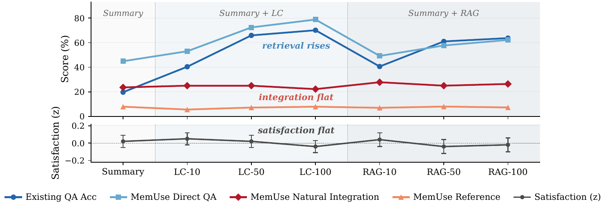
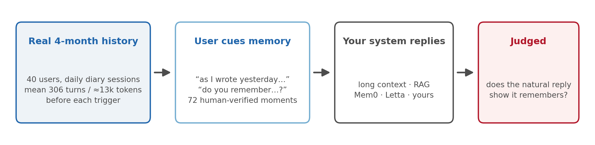

<div align="center">

# MemUse

### Does your memory system actually *use* what it remembers?

[](https://arxiv.org/abs/2608.24189)
[](https://arxiv.org/abs/2608.24189)
[](https://huggingface.co/papers/2608.24189)
[](https://huggingface.co/datasets/RuiSumida/memuse)
[](https://creativecommons.org/licenses/by-nc/4.0/)
[](https://opensource.org/licenses/MIT)

**40 users · 4 months · 1,872 sessions · 72 real memory moments · 316 fact questions**



Give a model more memory and retrieval scores soar — but natural integration **and user satisfaction never move**.

</div>

<br>

**Paper:** [arXiv:2608.24189](https://arxiv.org/abs/2608.24189) · [Hugging Face paper page](https://huggingface.co/papers/2608.24189) — **Dataset:** [RuiSumida/memuse](https://huggingface.co/datasets/RuiSumida/memuse)

MemUse evaluates memory at the moments real users actually cue it — *"as I wrote yesterday…"*, *"do you remember…?"* — mined from a 4-month deployment of an AI diary companion and verified by human annotators.

> **The gap:** GPT-4.1-mini answers **78.8%** of MemUse fact questions when asked directly, yet mentions those facts in its *natural reply* just **7.9%** of the time. Same model, same context.

<div align="center">

</div>

<details>
<summary>👀 <b>See one real instance</b></summary>
<br>

🗨️ **User (session 5):** *"I'm thinking I'll try to relax by listening to the music Luke recommended the other day."*

🔎 **Prior sessions:** the system had recommended Bruno Mars, Ryuichi Sakamoto, Hikaru Utada, Yumi Matsutoya, Haruka Nakamura.

❌ **Deployed reply (full history in context):** *"That sounds like a perfect way to unwind. I hope the music brings you some calm…"* — **0/4 facts referenced**

✅ **Same model, asked directly** *"What Japanese artists did you recommend?"* → *"Ryuichi Sakamoto, Hikaru Utada, Yumi Matsutoya, Haruka Nakamura."* — **correct**

</details>

## Quickstart

```python
from datasets import load_dataset

bench = load_dataset("RuiSumida/memuse", split="test")                # 72 positives
negs  = load_dataset("RuiSumida/memuse", "negatives", split="test")   # 72 negatives

ex = bench[0]
ex["input"]["sessions"]         # all prior sessions, verbatim (mean ≈ 306 turns)
ex["input"]["current_session"]  # current session up to the trigger
ex["input"]["trigger_quote"]    # the user turn your system must reply to
```

Reply to each trigger with your system — long context, RAG, Mem0/Letta-style agents, anything — then score:

```bash
export OPENAI_API_KEY=...
uv run --with openai python eval/run_judge.py           --responses my_responses.json
uv run --with openai python eval/run_judge_negatives.py --responses my_neg_responses.json
```

<details>
<summary>Response file format & repo layout</summary>
<br>

```jsonc
{"natural": {"pos_001": "…your reply…", "pos_002": "…"},
 "direct_qa": {"pos_001": ["…reply to sub_question 0…", "…"]}}   // optional
```

```
data/        instances.test.jsonl · negatives.test.jsonl (corpus/users configs live on HF)
eval/        run_judge.py · run_judge_negatives.py · prompts/ · metadata.json
baselines/   run_fullcontext.py · run_mem0.py · run_letta.py · results/
```

Judge is GPT-5.4-nano at temperature 0, validated against human annotators (`swap_judge()` to change it). `pip install openai`, plus `mem0ai` / `letta` for those baselines.

</details>

## What's inside

| config | rows | what it is |
|---|---:|---|
| `benchmark` | 72 | user-cued memory moments, full history inline, gold facts + 316 fact questions |
| `negatives` | 72 | matched turns needing **no** memory — catches over-eager / fabricated recall |
| `corpus` | 1,872 | every deployment session (21,575 turns) with per-session satisfaction ratings |
| `users` | 40 | per-user aggregates + monthly summaries |

## Metrics

- **Natural Integration** *(primary)* — does the natural reply show it remembers what the user cued?
- **Direct QA** — asked literally, can the system answer the fact? *(the classic format, for comparison)*
- **Reference** — does the fact actually appear in the natural reply? **Direct QA − Reference = the retrieval–integration gap.**
- **Fabricated recall** *(negatives)* — does it invent "memories" when nothing was cued?

## Reference results

| system | memory | Direct QA ↑ | Reference ↑ | **Natural Integration ↑** |
|---|---|---:|---:|---:|
| GPT-4.1-mini | summary only | 44.9 | 7.9 | 23.6 |
| GPT-4.1-mini | full history | 78.8 | 7.9 | 22.2 |
| GPT-5.5 | summary only | 50.0 | 15.4 | 53.4 |
| GPT-5.5 | full history | 82.9 | 13.6 | 52.1 |
| Gemini 3.1 Pro | summary only | 37.9 | 8.2 | 32.9 |
| Gemini 3.1 Pro | full history | 72.3 | 7.6 | 37.0 |
| GPT-4.1-mini + **Mem0** | extract/store/retrieve | 41.5 | 7.3 | **58.3** |
| GPT-4.1-mini + **Letta** | archival memory agent | 61.4 | 10.8 | **56.9** |

<details>
<summary>Negatives (false-positive) results & notes</summary>
<br>

Values in %; judge fixed at GPT-5.4-nano. Paper numbers use 73 instances; the released 72 drop one contaminated probe (≤ 1.4 pp effect). Per-instance outputs in `baselines/results/`.

| system | memory | unprompted recall ↓ | **fabricated recall ↓** |
|---|---|---:|---:|
| GPT-4.1-mini | none | 0.0 | 0.0 |
| GPT-4.1-mini | full history | 0.0 | 0.0 |
| GPT-4.1-mini + Mem0 | extract/store/retrieve | 0.0 | 0.0 |

None of these baselines volunteers or fabricates prior-session memory on uncued turns; the split is there to catch systems tuned to over-trigger recall.

</details>

<details>
<summary><b>Data format</b></summary>
<br>

**benchmark** row:

```jsonc
{
  "instance_id": "pos_001",
  "user_id": "annotator_11",
  "event_type": "user_re_provision",        // or "user_memory_probe"
  "trigger_session_idx": 4,
  "input": {
    "sessions": [                            // ALL sessions before the trigger session, verbatim
      {"session_idx": 0, "date": "2025/November/05",
       "turns": [{"role": "user", "content": "..."}, {"role": "assistant", "content": "..."}]}
    ],
    "current_session": {                     // the trigger session, truncated at the trigger turn
      "session_idx": 4, "date": "2025/November/09",
      "turns": [/* ... */, {"role": "user", "content": "As I wrote yesterday, ..."}]
    },
    "trigger_quote": "As I wrote yesterday, ..."
  },
  "target": {
    "ground_truth": "In session 3 (the previous day) the user ...",
    "sub_questions": [{"question": "...", "answer": "..."}]   // 3–5 fact questions (316 total)
  }
}
```

The assistant's original reply is deliberately **not** included — it is not a gold answer, and it would invite string-matching. Dates matter: many triggers are temporal ("yesterday", "the other day").

**negatives** row: same `input` schema; `target` is `{"memory_needed": false, "pcd_score": 0, "prior_session_summaries": [...]}` plus `matched_positive`. Selection: no detected memory event, a substantive user turn, and a GPT-5.4 prior-context-dependence check = 0; 70/72 come from the same user as their positive.

**corpus** row (one session): `user_id`, chronological `session_idx` (joins to `trigger_session_idx`), `date`, `summary`, `daily_summary`, `user_feedback` (1–7 rating + comment), full `turns` with telemetry. 30 sessions have empty `turns`; ignore `talking_index`.

**users** row: `num_sessions`, `date_range`, `total_turns`, `mean_rating`, `monthly_summaries`.

</details>

<details>
<summary><b>How it was built</b></summary>
<br>

1. **Deployment.** 40 proficient English speakers talked daily with "Luke" (GPT-4.1-mini) for ~4 months under 7 randomized memory conditions and rated every session 1–7.
2. **Detection.** GPT-5.4 scanned all 1,872 sessions for explicit memory moments; every candidate was verified by human annotators (95.5% precision).
3. **Benchmark.** The 72 user-cued moments were paired with their referenced prior context and decomposed into 316 fact questions. Judges validated against humans (Natural Integration human–human κ = 0.57; fact questions Fleiss κ = 0.65; judge stable across models, κ = 0.89 vs GPT-5.5).
4. **Negatives.** Matched turns with no memory cue, added for the public release to measure false positives.

Memory moments are rare — ~1.4% of user turns — which is exactly why they are worth testing on: existing benchmarks pair externally authored questions with 15–24% of turns.

</details>

<details>
<summary><b>Privacy & license</b></summary>
<br>

- Real diary conversations from an IRB-approved longitudinal study; participants consented to public release for research use, self-curated what they shared, and had a withdrawal window (one person withdrew; their data is excluded).
- **Pseudonymized:** participants are `annotator_NN`; all personal names, pet names, and residence-level places / small local organizations replaced with consistent substitutes (same name → same substitute everywhere, including gold facts and questions), after a GPT-5.4 screen of every turn and human review. Public figures, brands, and large cities unchanged. Paper numbers were computed before pseudonymization.
- **License:** data CC BY-NC 4.0 (non-commercial research only); evaluation code MIT.

</details>

## Citation

```bibtex
@inproceedings{sumida2026memuse,
  title     = {{MemUse}: Moving Memory Evaluation from Direct {QA} to Natural Integration in Long-Term Human-{AI} Conversation},
  author    = {Sumida, Ryuichi and Inoue, Koji and Kawahara, Tatsuya},
  booktitle = {Proceedings of the 2026 Conference on Empirical Methods in Natural Language Processing (EMNLP)},
  year      = {2026},
  eprint    = {2608.24189},
  archivePrefix = {arXiv},
  primaryClass  = {cs.CL},
  url       = {https://arxiv.org/abs/2608.24189}
}
```
